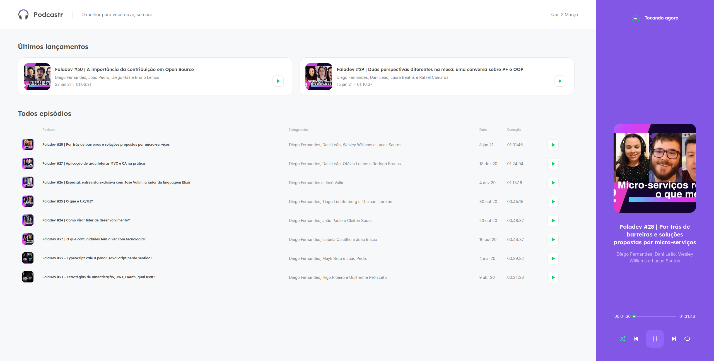

<h1 align="center"> Podcastr </h1>

  O podcastr é um app para reprodução de episódios em áudio do seu podcast favorito.

  <a href="#-tecnologias">Tecnologias</a>&nbsp;&nbsp;&nbsp;|&nbsp;&nbsp;&nbsp;
  <a href="#-projeto">Projeto</a>&nbsp;&nbsp;&nbsp;|&nbsp;&nbsp;&nbsp;
  <a href="#-layout">Layout</a>&nbsp;&nbsp;&nbsp;|&nbsp;&nbsp;&nbsp;
  <a href="#memo-licença">Licença</a>

  

 

  

## 🚀 Tecnologias

Esse projeto foi desenvolvido com as seguintes tecnologias:

- Next
- React
- TypeScript
- Styled-components
- Git
- Github

## 💻 Projeto

O podcastr é um app para reprodução de episódios em áudio do seu podcast favorito.

## 🚀 Como executar

- Clone o repositório
- Instale as dependências com `npm install`
- Inicie a fake api com `npm run server`
- Inicie o servidor com `npm run dev`

Agora você pode acessar [`localhost:3000`](http://localhost:3000) do seu navegador.

## 🔖 Layout

Você pode visualizar o layout do projeto através [DESSE LINK](https://www.figma.com/file/UwFEntsHpHYJlHNQAQr4gA/Podcastr/duplicate).

## :memo: Licença

Esse projeto está sob a licença MIT.

---

Projeto proposto pela Rocketseat como desafio  
by Matheus Ramalho - [matheusramalho.dev](matheusramalho.dev)
